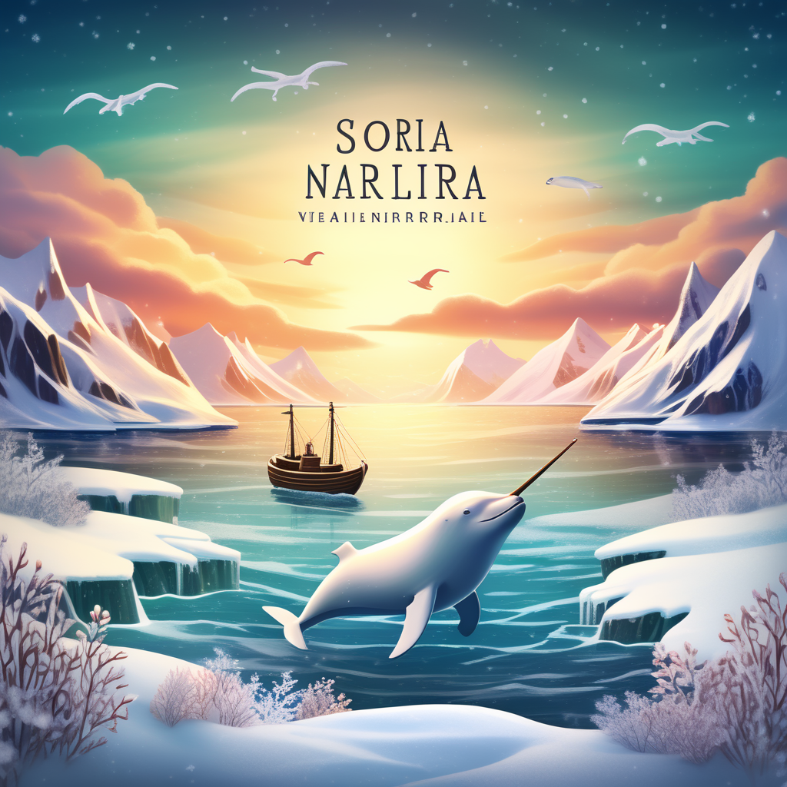

---  
share:True  
---  
  
  
  
Make a note of something, [[creat  
e a link]], or try [the Importer]({{< relref "https://help.obsidian.md" >*/}}/Plugins/Importer)!  
  
When you're ready, delete this note and make the vault your own.  
some  
![[https://github.com/wiikener/pic/blob/master/202401021046462.png]]  
  
  
